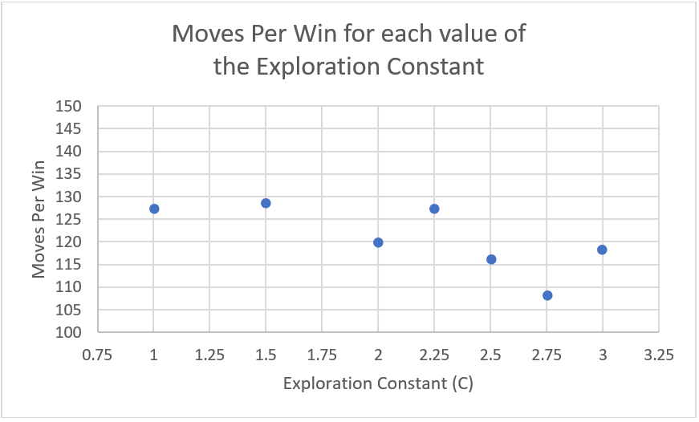

# COMP30024-AI-Projects

# Project B
Monte-Carlo implementation of an AI bot to play fictional RoPaSci game, using rudimentary Machine Learning. Scored 83%.

* [Algorithm Choice](#Algorithm-Choice)
* [Implementation](#Implementation)
* [Machine Learning](#Machine-Learning)
* [Evaluation Function](#Evaluation-Function)
* [Performance Evaluation](#Performance-Evaluation)
* [Future Extensions](#Future-Extensions)
* [Conclusion](#Conclusion)

## Algorithm Choice
For our Artificial Intelligence (AI) software, we opted to implement the Simultaneous Move Monte Carlo Tree Search (SM-MCTS) Algorithm with Upper Confidence Bounds Applied to Trees (UCT) to guide the decisions of our bot. The Monte Carlo Algorithm involves traversing a tree by choosing the option that maximises the Upper Confidence Bound value, calculated based on the number of visits of the parent, the current node and the average utility value of the current node. When an unvisited leaf is reached, a rollout phase is undertaken, randomly simulating until a terminal state is reached, and the value of this terminal state is then back propagated up to the root.

The decision to use the SM-MCTS algorithm came about after we reviewed the conclusions of Bošanský et al. (2016) on Algorithms in Simultaneous Two-Player Simultaneous Move Games. This work presented the conclusions about online game playing, where time and space constraints exist, that SM-MCTS can be preferable to Online Outcome Sampling, and that Double Oracle Algorithm with Serialized Bounds “depends heavily on the accuracy of the evaluation function” (Bošanský et al., 2016). Due to our lack of aptitude for machine learning, we decided against the choice of Double Oracle method with the hope of finding an effective evaluation function. Instead, we went for the SM-MCTS Algorithm, as this was presented as “often very good” with regret matching, and “sometimes… outperformed” when using UCT in games requiring “less randomized strategies” (Bošanský et al., 2016). We deemed RoPaSci-360 to fit this description of a less-random game, as although there are stochastic elements of simultaneous-play games, there is a strong element of strategy within the game, especially when we cannot simulate SM-MCTS to a terminal state due to it being an online game. Therefore, we decided to use SM-MCTS with UCT, as it is supported by this research as being a strong algorithm for online game performance.

## Implementation
With the Monte Carlo Tree Search  Algorithm, simultaneous moves are easily implemented for the game of RoPaSci-360. This is done by generating a random move for both the player and the opponent during the rollout, and applying these and evaluating the outcome board. This removes any strategy for predicting opponent moves and enlarges the search space, but we deemed this trade-off acceptable for the increase in simplicity and speed of generating these random states for the rollout.

We made some modifications to the base algorithm for the goal of improving the speed of decision-making of the algorithm. Firstly, the algorithm only considers throwing one type of piece from any given state based on the opponent’s tokens. For example, when the player and opponent are both on their 8th throw they could throw to any tile on the 61 tile board. Combining this with the 3 token types, there are (3*61)^2 ≈ 33000 possible throw combinations. By only considering one type of token for throwing from each state, we were able to reduce this to 61^2 ≈ 4000 possible combinations.

This tradeoff in optimality was deemed necessary for the online environment. Beyond this, we also implemented an iteration cut-off of 250 for the tree traversal algorithm, and a cut-off of 250 for the rollout phase. These variables limit the depth that the tree is explored and the number of boards generated. Although this impacts the optimality, it was deemed appropriate given the online environment and time and space constraints.

## Machine Learning
The only other change in game-playing strategy from the SM-MCTS algorithm was for the beginning of the game. We did not undertake any machine-learning practices, however we did create a simple early-game database for the first 3 moves, as these book moves can offer reductions in unnecessary calculation time early on in the game. This started with a random token type for the first throw, as the choice will not matter because the expected value will be equal for each type, 1/3.
Fine-tuning Constants
We only fine-tuned the single value C for our algorithm. In future we would use more formal methods to fine-tune, and we would do this for more than just the C value, as discussed in the future extensions section. 

We used random guessing for our C value, testing different values of C against the Greedy opponent on the battleground, using max cutoff and max iteration values of 250. We operated under the premise that minimising the number of moves it takes to beat the greedy algorithm is correlated to the strength of the algorithm. We tested this locally and in dimefox using the linux command: 
“for i in {1..25}; do python -m battleground Robots_2005 Testing greedy -l --verbosity 1; wc -l < battle.log >> movecounts.txt; done”
From the output file movecounts.txt, each file line was divided by two (to get the move count) and then averaged and graphed against its respective C value.

Figure 1. Moves Per Win against a Greedy Opponent, depending on the Exploration Constant.

 
As seen in Figure 1., this testing showed that the number of moves per win decreased around the value of C = 2.75, and hence we ultimately used this value. We initially only tested increments of 0.5, however after a convergence was discovered around 2.5-3, we decided to test additional values near this point, 2.25 and 2.75.

## Evaluation Function
Our evaluation function was relatively simple, which we felt confident using as we had pruned the search space by only considering throws depending on the count of the opponent’s tokens, massively reducing the number of nodes generated. The evaluation function for a given board state calculated the difference between the total tokens the player has left, and the total the opponent has left, including throws. This evaluates to a representation of whether opponent or player tokens have been killed, where the player aims to maximise the difference. 

We tested multiple evaluation functions including one that subtracted the minimum distance for the player to kill a node, and added the minimum distance for an opponent to kill a node, which would therefore aim to have the player avoid losing tokens and move toward killing tokens. However, this resulted in some undesirable behaviour of continuously throwing the same type of token to reduce the distance to kill a node, which we deemed unreasonable for the computation cost required to calculate this.

## Performance Evaluation
### Complexity:
To understand the performance of the MonteCarlo algorithm we first analysed the complexity of the algorithm. 
MonteCarloTreetraversal():
	While current is not a leaf:
		Current = maxUCB1(children of current)
	If current has not been visited:
		rollout(current)
	Else:
		expandTree():
		If current is a leaf:
			rollout(current)
		Else:
			Current = first child of current 
			rollout(current)

rollout() has a complexity of O(c*m) where c is the specified depth of a rollout and m is the maximum number of possible board states that can be generated from a board.
expandTree() has a complexity of O(m) because it is just creating all the possible board states based on all the available moves for the current node.
maxUCB1() has a complexity of O(m) because it is just iterating through all the immediate children of one board state.

Therefore, MonteCarloTreeTraversal() has a complexity of O(c*d*m) where d is the current depth of the tree because it runs maxUCB1() until it reaches a leaf.
MonteCarlo():
	i = 0
	While i < maximum number of iterations:
		treeTraversal()
		backPropagate()

backPropagate() has a complexity of O(d*m) as it must iterate all the way up the tree from the node the previous rollout started at while it sums all the values of each node’s immediate children.
Therefore, overall the Monte-Carlo algorithm has a complexity of O(p*c*d*m) where p is the specified maximum number of iterations the tree traversal can run. p and c are constants so the efficiency of the algorithm is mainly determined by how many possible moves are available in each state of the board.

In order to optimize the algorithm based on the complexity, as mentioned prior we tried to minimise the total number of moves that it would consider from each board state. By considering only throwing one token type as mentioned in the implementation section, we reduced the search space by almost 10x from ~33,000 to ~4,000.

### Performance:
Our main indicator of algorithm performance was the average time it took to make a move. We used this to help us choose a maximum number of iterations the tree traversal and back propagation could be run, as well as the maximum cut-off depth the rollout could be run to.

Figure 2. Average Time per Move for varying cut-off values of the tree traversal and rollout phases

 
To get this data we ran our algorithm against itself. We ideally wanted 0.167 seconds per move to achieve 360 moves within 60 seconds (i.e. the maximum number of moves within the time limit). After this analysis we chose CUTOFF = MAXITER = 250 because it was the lowest value for both where we got a small time/move and draws did not occur frequently. 

At lower cut-off depths, the algorithm cannot look far enough in advance during the rollout in order to find board states with significantly different values. If the maximum number of iterations is too small the algorithm is not run enough times in order to generate a value for each move from the current state of the game, so it often misses opportunities to throw or swing and the game ends in a draw more often. 

When the CUTOFF and MAXITER were above 250 the computation time seemed to take longer without any perceived benefits. For example, the algorithm was not beating greedy in fewer moves. Therefore, 250 for both was our choice keeping in mind that the algorithm takes longer to run against itself and can successfully beat greedy in under 60 seconds with these values. Note, these values were tested with C = 2.

### Monte-Carlo vs Minimax:
Before implementing Monte-Carlo we used Minimax with artificially divided turns. Although successfully implemented (we tested on trees with randomly generated values at the leaves), when run against opponents the algorithm was far too slow and could not look ahead more than one move and still have a reasonable computation time. Monte-Carlo seemed ideal because it is similar to simultaneous minimax in choosing moves with the best value only to a small depth, but the rollout made it significantly better as it was able to look much farther in advance with some randomness.

## Future Extensions
If we were to extend our game-playing algorithm in the future, there are multiple enhancements we would make. Firstly, we would implement the progressive strategies outlined by Chaslot et al. (2008) in “Progressive Strategies for Monte-Carlo Tree Search”, Progressive Bias and Progressive Widening, also known as Progressive ‘Unpruning’. After that, we would use the Cross-Entropy Method for fine-tuning the parameters of our MCTS algorithm, as discussed by Chaslot, Winands & Jaap Van Den Herik (2008).

Progressive Bias involves biasing the search towards heuristic knowledge by altering the selection strategy to take this heuristic knowledge into account. Progressive Widening, the more relevant strategy to this situation, involves pruning children with low heuristic values, then unpruning these nodes as the number of simulations for a parent surpasses a threshold value. These strategies together were shown by Chaslot et al. (2008) to improve the play of their Go game-playing algorithm at every board size, and hence would be valuable to add to our RoPaSci-360 algorithm, likely improving its performance. 

The Cross-Entropy Method for fine-tuning parameters for the MCTS Algorithm includes variables such as C, the Exploration Coefficient, and T, the number of times a node is visited before its children are expanded, and multiple more.  Chaslot, Winands & Jaap Van Den Herik (2008) found that this method “genuinely improved the playing strength” of their Go playing algorithm, and hence this indicates that this method will likely have merit for optimising our algorithm. We undertook Random Guessing for our C, max cut-off and max iteration values, attempting to fine-tune these values for our algorithm, however in future formally implementing the Cross-Entropy Method would likely yield more effective results. Furthermore, using additional testing runs on our data would improve the accuracy of our variables, as there is much randomness in the outcome of the game.

## Conclusion
We implemented the Monte-Carlo Algorithm as it was supported by the literature for game-playing AI in an online environment. It was fairly successful, winning against both random and greedy bots consistently, without going over the time limit. We did not implement all the machine learning techniques that were researched, but did lay out plans for future enhancements that would significantly improve performance. 

## References
Bosansky, Branislav & Lisy, Viliam & Lanctot, Marc & Cermak, Jiri & Winands, Mark. (2016). Algorithms for Computing Strategies in Two-Player Simultaneous Move Games. Artificial Intelligence. 237. doi: 10.1016/j.artint.2016.03.005. 
Chaslot, Guillaume & Winands, Mark & Herik, H. & Uiterwijk, Jos & Bouzy, Bruno. (2008). Progressive Strategies for Monte-Carlo Tree Search. New Mathematics and Natural Computation. 04. 343-357. doi: 10.1142/S1793005708001094. 
Chaslot, Guillaume & Winands, Mark & Szita, Istvan & Herik, H.. (2008). Cross-Entropy for Monte-Carlo Tree Search.. ICGA Journal. 31. 145-156. doi: 10.3233/ICG-2008-31303. 
Saffidine, Abdallah & Finnsson, Hilmar & Buro, Michael. (2012). Alpha-Beta Pruning for Games with Simultaneous Moves. Proceedings of the National Conference on Artificial Intelligence. 1.

